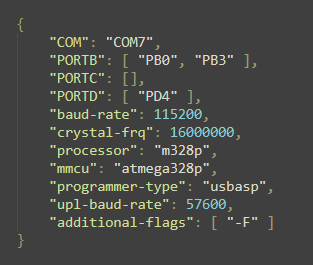

# AVR-to-Key
This project demonstrates how to use AVR microcontrollers, which do not have native USB keyboard support, to function as a USB HID (Human Interface Device) keyboard. By leveraging the flexibility and power of AVR microcontrollers, you can create custom keyboards and input devices for various applications. Or use physical buttons as inputs for game to experience the realism in your sim hub.

## Installation:

***Note: This project is built only for Windows.***

1. Download & extract the **zip** file or **clone** this repository.
2. You should see two `.json` files. These are for your configuration purposes, where `payload.json` is for hardware settings & `keymap.json` is for keymaping the active pins.

3. **PAYLOAD.JSON**

4. Here, 
   i.    `"COM"` - COM Port through which the microcontroller is talking to the PC. Check **Device Manager** in case if u are not aware of which port. 
   ii.   `"PORTB"` - Array of the currently using **PORT B** pins on the microcontroller. Leave blank if none of the pins belonging to **PORT B** are used. 
   iii.  `"PORTC"` - I think you have understood. 
   iv.   `"PORTD"` - Huh, again! 
   v.    `"baud-rate"` - Dev guys know it. If you don't know what it is, just go with `9600` or `115200`. 
   vi.   `"crystal-frq"` - Frequency of the crystal oscillator in Hz. Again if you don't know, closely look at the dev board, you should see something like this 🢃 

  
