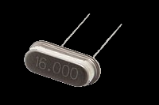
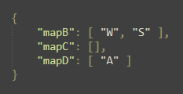

# AVR-to-Key
This project demonstrates how to use **AVR** microcontrollers, which do **not** have **native USB keyboard support**, to function as a **USB HID (Human Interface Device) keyboard**. By leveraging the flexibility and power of **AVR** microcontrollers, you can create custom keyboards and input devices for various applications. Or use **physical** buttons as **inputs** for game to experience the realism in your **sim hub**.

## Installation:

***Note: This project is built only for Windows.***

**1.** Download & extract the **zip** file or **clone** this repository.
**2.** You should see two `.json` files. These are for your configuration purposes, where `payload.json` is for hardware settings & `keymap.json` is for keymaping the active pins. 

## How to use AVR-to-Key?

**1.** **PAYLOAD.JSON**

**2.** Here, 
   *i.*    `"COM"` - COM Port through which the microcontroller is talking to the PC. Check **Device Manager** in case if u are not aware of which port. 
    
   *ii.*   `"PORTB"` - Array of the currently using **PORT B** pins on the microcontroller. Leave blank if none of the pins belonging to **PORT B** are used. 
    
   *iii.*  `"PORTC"` - I think you have understood. 
    
   *iv.*   `"PORTD"` - Huh, again! 
    
   *v.*    `"baud-rate"` - Dev guys know it. If you don't know what it is, just go with `9600` or `115200`. 
    
   *vi.*   `"crystal-frq"` - Frequency of the crystal oscillator(Clock) in Hz. Again if you don't know, closely look at the dev board, you should see something like this ↓ 
  
 
    
   *vii.*   `"processor"` - Write the processor name in this format => `m<serial_number>`. 
    
   *viii.*  `"mmcu"` - Same as processor replace `m` with `atmega`. 
    
   *ix.* `"programmer-type"` - Programmer. 
    
   *x.* `"upl-baud-rate"` - Set it according to your microcontroller. **NOTE:** if you are using Atmega328p (Old Bootloader) then set it to `57600`. 
    
   *xi.* `"additional-flags"` - If you wish to add any flags during **upload** add them with the hyphen as a string. Ex: **"-F"**. Else leave it as it is. 
    
   
**3.** **KEYMAP.JSON**
   
 

Here, `"mapB"` belongs to `"PORTB"` & same for other maps & PORTS. You must map them in the order same as of one in `payload.json` PORT array ("PORTB", "PORTC", & "PORTD"). 

Ex: From the images, `"PB0"` is mapped to the letter `W`. That means, when the button (connected to the PB0 pin on the microcontroller) is pressed, the letter `W` gets typed on your PC. 

