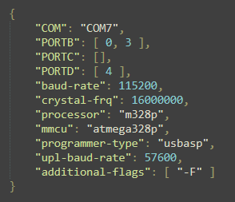

# AVR-to-Key
This project demonstrates how to use AVR microcontrollers, which do not have native USB keyboard support, to function as a USB HID (Human Interface Device) keyboard. By leveraging the flexibility and power of AVR microcontrollers, you can create custom keyboards and input devices for various applications. Or use physical buttons as inputs for game to experience the realism in your sim hub.

## Installation:

***Note: This project is built only for Windows***

1. Download & extract the **zip** file or **clone** this repository.
2. You should see 2 `.json` files. These are for your configuration purposes, where `payload.json` is for hardware settings & `keymap.json` is for keymaping the active pins.
3. **PAYLOAD**

4. 
